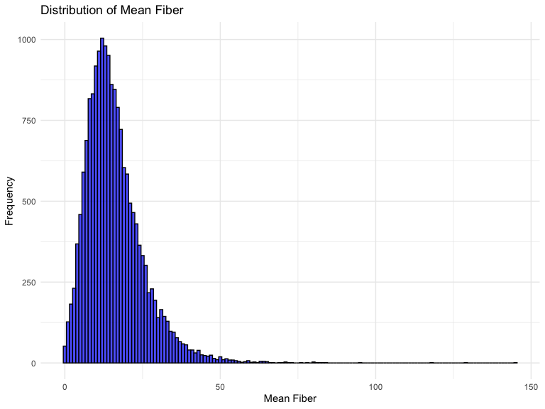
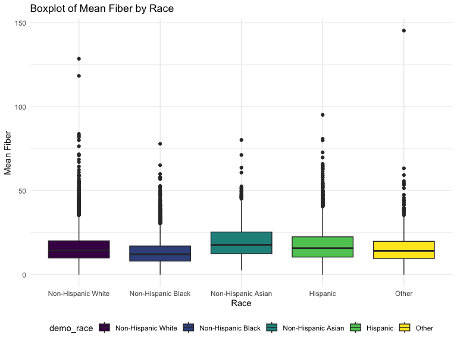
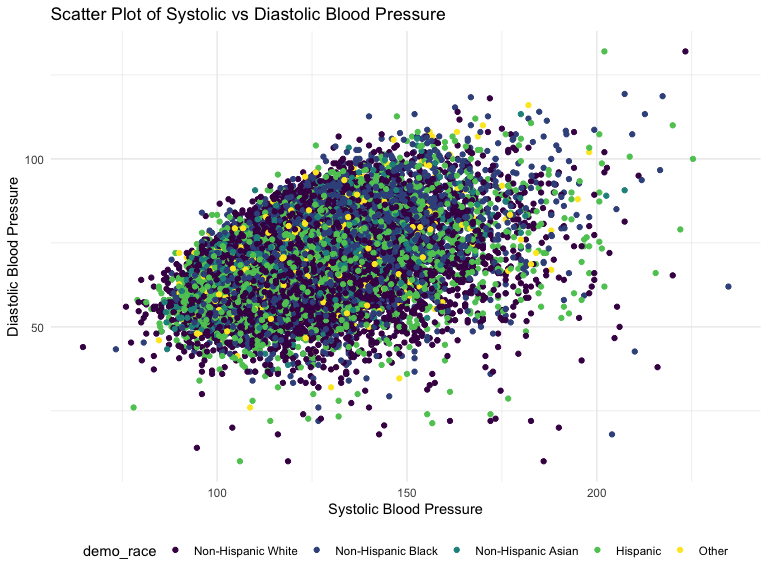
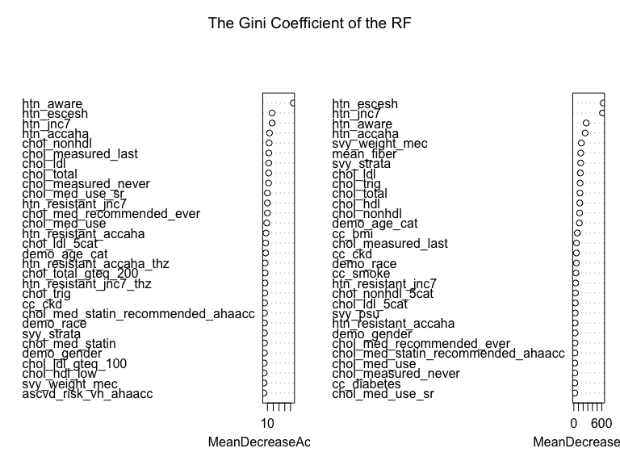

Main Data Analysis
================
Yangyang Chen
2024-01-17

## Data

### Importing dataframe

``` r
load("~/Desktop/2024_DataFest/main_data/nhanes_data.rda")
main_df = nhanes_data
df_99 = 
  readxl::read_xlsx("Dietary_data/1999-2000daysmean.xlsx") |> 
  rename(MEAN_FIBER = DR_MEAN) |> 
  select(SEQN, MEAN_FIBER, YEAR)
df_01 = 
  readxl::read_xlsx("Dietary_data/2001-2002daysmean.xlsx") |> 
  rename(MEAN_FIBER = DR_MEAN) |> 
  select(SEQN, MEAN_FIBER, YEAR)
df_03 = 
  readxl::read_xlsx("Dietary_data/2003-2004daysmean.xlsx") |> 
  rename(MEAN_FIBER = DR_MEAN) |> 
  select(SEQN, MEAN_FIBER, YEAR)
df_05 = 
  readxl::read_xlsx("Dietary_data/2005-2006daysmean.xlsx") |> 
  rename(MEAN_FIBER = DR_MEAN) |> 
  select(SEQN, MEAN_FIBER, YEAR)
df_07 = 
  readxl::read_xlsx("Dietary_data/2007-2008daysmean.xlsx") |> 
  rename(MEAN_FIBER = DR_MEAN) |> 
  select(SEQN, MEAN_FIBER, YEAR)
df_09 = 
  readxl::read_xlsx("Dietary_data/2009-2010daysmean.xlsx") |> 
  rename(MEAN_FIBER = DR_MEAN) |> 
  select(SEQN, MEAN_FIBER, YEAR)
df_11 = 
  readxl::read_xlsx("Dietary_data/2011-2012daysmean.xlsx") |> 
  rename(MEAN_FIBER = DR_MEAN) |> 
  select(SEQN, MEAN_FIBER, YEAR)
df_13 = 
  readxl::read_xlsx("Dietary_data/2013-2014daysmean.xlsx") |> 
  rename(MEAN_FIBER = DR_MEAN) |> 
  select(SEQN, MEAN_FIBER, YEAR)
df_15 = 
  readxl::read_xlsx("Dietary_data/2015-2016daysmean.xlsx") |> 
  rename(MEAN_FIBER = DR_MEAN) |> 
  select(SEQN, MEAN_FIBER, YEAR)
df_17 = 
  readxl::read_xlsx("Dietary_data/2017-2020daysmean.xlsx") |> 
  rename(MEAN_FIBER = DR_MEAN) |> 
  select(SEQN, MEAN_FIBER, YEAR)

# Combining Fiber Data
fiber_df =   
  df_99 |> 
  rbind(df_01) |> 
  rbind(df_03) |> 
  rbind(df_05) |> 
  rbind(df_07) |> 
  rbind(df_09) |> 
  rbind(df_11) |> 
  rbind(df_13) |> 
  rbind(df_15) |> 
  rbind(df_17)
```

### Data Cleaning

``` r
fiber_tidy_df = 
  fiber_df |> 
  janitor::clean_names() |> 
  rename(
    svy_id = seqn,
    svy_year = year
         ) 

# Combining main data and fiber data, and remove NA
df = 
  left_join(fiber_tidy_df, main_df) |> 
  drop_na()
```

    ## Joining with `by = join_by(svy_id, svy_year)`

``` r
# Determine the BP as our dependent variable --> create a new binary column called bp: uncontrolled(0): SBP > 140 or DBP > 90 and controlled(1): SBP < 140 and DBP < 90. 
df_with_bp <-
  df %>%
  mutate(bp = ifelse(bp_sys_mean < 140 & bp_dia_mean < 90, "controlled", "uncontrolled"))
# remove the unnecessary bp columns
df_with_bp_2 <-
  df_with_bp %>% 
  select(-contains('bp_'))%>%
  relocate(bp, .after = svy_year)
```

## Exploratory Data Analysis

``` r
table_gender = 
df_with_bp_2 %>%
  group_by(demo_gender) %>%
  summarise(
    Count = n(), # total number of entries for each gender
    Controlled = sum(bp == "controlled"), # number of outcomes with value 0
    Uncontrolled = sum(bp == "uncontrolled"), # number of outcomes with value 1
    Percentage = Controlled/Count
  ) %>%
  knitr::kable(digits = 3)  
```

``` r
# Define age intervals
age_breaks <- c(-Inf, 18, 45, 65, 75, Inf)
age_labels <- c("Under 18",'18-44', '45-64', '65-74', 'Over 75')

# Create age groups and summarize outcomes
df_with_bp_2 %>%
  mutate(Age_group = cut(demo_age_years, breaks = age_breaks, labels = age_labels, right = FALSE)) %>%
  group_by(demo_age_cat) %>%
  summarise(Count = n(),
            Controlled = sum(bp == "controlled", na.rm = TRUE),
            Uncontrolled = sum(bp == "uncontrolled", na.rm = TRUE),
            Percentage = Controlled/(Controlled + Uncontrolled)) %>%
  knitr::kable(digits = 3)  
```

| demo_age_cat | Count | Controlled | Uncontrolled | Percentage |
|:-------------|------:|-----------:|-------------:|-----------:|
| 18 to 44     |  7399 |       6908 |          491 |      0.934 |
| 45 to 64     |  6294 |       4926 |         1368 |      0.783 |
| 65 to 74     |  2529 |       1680 |          849 |      0.664 |
| 75+          |  1799 |        986 |          813 |      0.548 |

``` r
# Scatter plot of bp_sys_mean vs bp_dia_mean
ggplot(df, aes(x = bp_sys_mean, y = bp_dia_mean, color = demo_race)) +
  geom_point() +
  labs(title = "Scatter Plot of Systolic vs Diastolic Blood Pressure",
       x = "Systolic Blood Pressure", y = "Diastolic Blood Pressure")
```



``` r
df %>%
  ggplot(aes(x = bp_sys_mean, fill = demo_race)) +
  geom_density(alpha = 0.7) +
  labs(title = "Grouped Density Plot of Systolic Blood Pressure by Race", x = "Systolic Blood Pressure") +
  theme_minimal()
```



``` r
df %>%
  ggplot(aes(x = bp_sys_mean)) +
  geom_histogram(binwidth = 5, fill = "lightblue", color = "black", alpha = 0.7) +
  geom_density(color = "darkred", size = 1) +
  labs(title = "Histogram with Density Plot of Systolic Blood Pressure", x = "Systolic Blood Pressure") +
  theme_minimal()
```



## Random Forests

``` r
# Remove unnecessary data
data <- 
  df_with_bp_2 %>%
  select(-c(svy_id,svy_year,svy_subpop_htn,svy_subpop_chol,demo_age_years))%>%
  mutate(bp = factor(bp))
# Factor all the categorical data
is.fact <- sapply(data, is.factor)
data_categroies <- 
  data[, is.fact]%>%
  mutate_all(~factor(.))
data_categroies
```

    ## # A tibble: 18,021 × 61
    ##    bp           demo_age_cat demo_race demo_race_black demo_pregnant demo_gender
    ##    <fct>        <fct>        <fct>     <fct>           <fct>         <fct>      
    ##  1 controlled   75+          Non-Hisp… No              No            Men        
    ##  2 controlled   45 to 64     Non-Hisp… No              No            Men        
    ##  3 controlled   45 to 64     Non-Hisp… Yes             No            Women      
    ##  4 uncontrolled 18 to 44     Non-Hisp… No              No            Men        
    ##  5 controlled   18 to 44     Non-Hisp… No              No            Women      
    ##  6 controlled   18 to 44     Hispanic  No              Yes           Women      
    ##  7 controlled   18 to 44     Non-Hisp… No              No            Women      
    ##  8 controlled   45 to 64     Non-Hisp… No              No            Men        
    ##  9 controlled   18 to 44     Non-Hisp… Yes             No            Women      
    ## 10 controlled   45 to 64     Hispanic  No              No            Women      
    ## # ℹ 18,011 more rows
    ## # ℹ 55 more variables: htn_jnc7 <fct>, htn_accaha <fct>, htn_escesh <fct>,
    ## #   htn_aware <fct>, htn_resistant_jnc7 <fct>, htn_resistant_accaha <fct>,
    ## #   htn_resistant_jnc7_thz <fct>, htn_resistant_accaha_thz <fct>,
    ## #   chol_measured_never <fct>, chol_measured_last <fct>,
    ## #   chol_total_gteq_200 <fct>, chol_total_gteq_240 <fct>, chol_hdl_low <fct>,
    ## #   chol_trig_gteq_150 <fct>, chol_ldl_5cat <fct>, chol_ldl_lt_70 <fct>, …

``` r
# A dataframe with all numerical data in data
data_numerical <- 
  select_if(data, is.numeric)
data_numerical
```

    ## # A tibble: 18,021 × 9
    ##    mean_fiber svy_weight_mec svy_psu svy_strata chol_total chol_hdl chol_trig
    ##         <dbl>          <dbl>   <dbl>      <dbl>      <dbl>    <dbl>     <dbl>
    ##  1      13.2          28325.       3          1        215       54       128
    ##  2      15.5          99445.       2          8        279       42       347
    ##  3       5.83         25525.       2          4        245      105        62
    ##  4      14.5          95494.       2          6        156       38       146
    ##  5       8.31        114519.       2         11        199       58        54
    ##  6      12.1          16737.       2          2        145       43       117
    ##  7       6.27        135254.       1          5        159       55       202
    ##  8       5.08         47955.       2         12        216       49       167
    ##  9       2.94         27063.       1          7        195       41        97
    ## 10      11.5           8238.       2          9        285       66       210
    ## # ℹ 18,011 more rows
    ## # ℹ 2 more variables: chol_ldl <dbl>, chol_nonhdl <dbl>

``` r
#Combine categorical data and numerical data frame
data_final = cbind(data_numerical, data_categroies)
```

``` r
index = caret::createDataPartition(data_final$bp,p=0.7,list = FALSE)
train_df = data_final[index, ]
test_df = data_final[-index, ]
#randomForest_model = ranger(formula = bp ~ ., data = train_df)
#randomForest_model = train(bp~., 
 #                data = train_df, 
 #               method = "ranger")
randomForest_model = randomForest(bp~.,data= train_df,importance=TRUE, ntree=300)
```

``` r
prediction = predict(randomForest_model,test_df)
confustion_matrix = table(prediction, test_df$bp)
accuracy = sum(diag(confustion_matrix))/sum(confustion_matrix)
cat("Accuracy",accuracy,"\n")
```

    ## Accuracy 0.8923418

``` r
confustion_matrix %>%
  knitr::kable(caption="Confusion Matrix of randomForest")
```

|              | controlled | uncontrolled |
|:-------------|-----------:|-------------:|
| controlled   |       4124 |          356 |
| uncontrolled |        226 |          700 |

Confusion Matrix of randomForest

``` r
importance = varImp(randomForest_model)
varImpPlot(randomForest_model, main = "The Gini Coefficient of the RF")
```



### Logistics Regression

``` r
convert_to_factor <- function(df, columns) {
  df[columns] <- lapply(df[columns], factor)
  return(df)
}

df_tidy = 
  df_with_bp_2 |>
  convert_to_factor(c("bp", "demo_age_cat", "demo_race", "demo_race_black", "demo_pregnant", "demo_gender", "htn_jnc7", "htn_accaha",   "htn_escesh",   "htn_aware",    "htn_resistant_jnc7",   "htn_resistant_accaha", "htn_resistant_jnc7_thz",   "htn_resistant_accaha_thz", "chol_measured_never",  "chol_measured_last", "chol_total_gteq_200",    "chol_total_gteq_240", "chol_hdl_low", "chol_trig_gteq_150", "chol_ldl_5cat",   "chol_ldl_lt_70",   "chol_ldl_gteq_70", "chol_ldl_lt_100",  "chol_ldl_gteq_100",    "chol_ldl_gteq_190",    "chol_ldl_persistent", "chol_nonhdl_5cat",  "chol_nonhdl_lt_100",   "chol_nonhdl_gteq_100", "chol_nonhdl_gteq_220", "chol_med_use", "chol_med_use_sr",  "chol_med_statin",  "chol_med_ezetimibe",   "chol_med_pcsk9i",  "chol_med_bile",    "chol_med_fibric_acid", "chol_med_atorvastatin",    "chol_med_simvastatin", "chol_med_rosuvastatin",    "chol_med_pravastatin", "chol_med_pitavastatin",    "chol_med_fluvastatin", "chol_med_lovastatin",  "chol_med_other",   "chol_med_addon_use",   "chol_med_addon_recommended_ahaacc",    "chol_med_statin_recommended_ahaacc",   "chol_med_recommended_ever",    "ascvd_risk_vh_ahaacc", "cc_smoke", "cc_bmi",   "cc_diabetes",  "cc_ckd",   "cc_cvd_mi",    "cc_cvd_chd",   "cc_cvd_stroke",    "cc_cvd_ascvd", "cc_cvd_hf",    "cc_cvd_any"))

glm_complete = glm(bp ~ ., data = df_tidy, family = binomial(link = logit))
```

``` r
# Create binary variable for 'bp_uncontrolled_jnc7'
df_with_bp_2 = df_with_bp_2 |> 
  mutate(
    bp_binary = as.integer(bp == 'controlled'),
    chol_nonhdl_lt_100_binary = as.integer(chol_nonhdl_lt_100 == 'Yes'), 
    chol_nonhdl_gteq_100_binary = as.integer(chol_nonhdl_gteq_100 == 'Yes'),    
    chol_nonhdl_gteq_220_binary = as.integer(chol_nonhdl_gteq_220 == 'Yes'),
    chol_med_use_binary = as.integer(chol_med_use == 'Yes'),    
    chol_med_use_sr_binary = as.integer(chol_med_use_sr == 'Yes'),
    chol_med_statin_binary = as.integer(chol_med_statin == 'Yes'),
    chol_med_ezetimibe_binary = as.integer(chol_med_ezetimibe == 'Yes'),    
    chol_med_pcski_binary = as.integer(chol_med_pcsk9i == 'Yes'),   
    chol_med_bile_binary = as.integer(chol_med_bile == 'Yes'),  
    chol_med_fibric_acid_binary = as.integer(chol_med_fibric_acid == 'Yes'),
    chol_med_atorvastatin_binary = as.integer(chol_med_atorvastatin == 'Yes'),
    chol_med_simvastatin_binary = as.integer(chol_med_simvastatin == 'Yes'),
    chol_med_rosuvastatin_binary = as.integer(chol_med_rosuvastatin == "Yes"),
    chol_med_pravastatin_binary = as.integer(chol_med_pravastatin == 'Yes'),
    chol_med_pitavastatin_binary = as.integer(chol_med_pitavastatin == "Yes"),
    chol_med_fluvastatin_binary = as.integer(chol_med_fluvastatin == "Yes"),    
    chol_med_lovastatin_binary = as.integer(chol_med_lovastatin == "Yes"),  
    chol_med_other_binary = as.integer(chol_med_other == "Yes"),    
    chol_med_addon_use_binary = as.integer(chol_med_addon_use == "Yes"),
    chol_med_addon_recommended_ahaacc_binary =  as.integer(chol_med_addon_recommended_ahaacc == "Yes"), 
    chol_med_statin_recommended_ahaacc_binary = as.integer(chol_med_statin_recommended_ahaacc == "Yes")
    ) 

# Select relevant variables
selected_vars <- c("mean_fiber",    "svy_weight_mec", "svy_psu", "svy_strata",  "chol_total",   "chol_hdl", "chol_trig","chol_nonhdl","chol_nonhdl","demo_age_cat","demo_race","demo_race_black","demo_pregnant","demo_gender", "bp_binary")
df_with_bp_2 <- df_with_bp_2 %>% select(all_of(selected_vars))

# Create logistic regression model using tidyverse functions
logit_model <- glm(bp_binary ~ ., data = df_with_bp_2, family = "binomial")

# Display model summary
tidy_logit <- tidy(logit_model)
glance_logit <- glance(logit_model)
conf_int <- confint(logit_model)
```

    ## Waiting for profiling to be done...

``` r
# Display results
tidy_logit
```

    ## # A tibble: 19 × 5
    ##    term                           estimate    std.error statistic    p.value
    ##    <chr>                             <dbl>        <dbl>     <dbl>      <dbl>
    ##  1 (Intercept)                  3.14        0.156          20.2    1.67e- 90
    ##  2 mean_fiber                   0.0111      0.00242         4.59   4.50e-  6
    ##  3 svy_weight_mec               0.00000407  0.000000880     4.62   3.77e-  6
    ##  4 svy_psu                      0.0748      0.0382          1.96   5.04e-  2
    ##  5 svy_strata                   0.00128     0.000442        2.90   3.75e-  3
    ##  6 chol_total                  -0.00318     0.000551       -5.78   7.54e-  9
    ##  7 chol_hdl                    -0.00179     0.00154        -1.16   2.44e-  1
    ##  8 chol_trig                   -0.00186     0.000259       -7.18   7.12e- 13
    ##  9 chol_nonhdl                 NA          NA              NA     NA        
    ## 10 demo_age_cat45 to 64        -1.24        0.0575        -21.5    1.95e-102
    ## 11 demo_age_cat65 to 74        -1.87        0.0665        -28.1    3.49e-173
    ## 12 demo_age_cat75+             -2.43        0.0758        -32.1    2.11e-225
    ## 13 demo_raceNon-Hispanic Black -0.713       0.0657        -10.9    1.92e- 27
    ## 14 demo_raceNon-Hispanic Asian  0.0830      0.124           0.667  5.05e-  1
    ## 15 demo_raceHispanic           -0.0996      0.0648         -1.54   1.24e-  1
    ## 16 demo_raceOther              -0.255       0.120          -2.13   3.29e-  2
    ## 17 demo_race_blackYes          NA          NA              NA     NA        
    ## 18 demo_pregnantYes             2.25        0.454           4.97   6.82e-  7
    ## 19 demo_genderWomen             0.0687      0.0434          1.58   1.13e-  1

``` r
glance_logit
```

    ## # A tibble: 1 × 8
    ##   null.deviance df.null logLik    AIC    BIC deviance df.residual  nobs
    ##           <dbl>   <int>  <dbl>  <dbl>  <dbl>    <dbl>       <int> <int>
    ## 1        17802.   18020 -7701. 15436. 15569.   15402.       18004 18021

``` r
conf_int
```

    ##                                     2.5 %        97.5 %
    ## (Intercept)                  2.835905e+00  3.446174e+00
    ## mean_fiber                   6.397665e-03  1.590068e-02
    ## svy_weight_mec               2.355528e-06  5.803801e-06
    ## svy_psu                     -4.596730e-05  1.498151e-01
    ## svy_strata                   4.162530e-04  2.150704e-03
    ## chol_total                  -4.260769e-03 -2.102063e-03
    ## chol_hdl                    -4.802806e-03  1.234481e-03
    ## chol_trig                   -2.362352e-03 -1.347716e-03
    ## chol_nonhdl                            NA            NA
    ## demo_age_cat45 to 64        -1.349909e+00 -1.124332e+00
    ## demo_age_cat65 to 74        -1.997274e+00 -1.736455e+00
    ## demo_age_cat75+             -2.580299e+00 -2.282943e+00
    ## demo_raceNon-Hispanic Black -8.416121e-01 -5.841898e-01
    ## demo_raceNon-Hispanic Asian -1.573769e-01  3.309447e-01
    ## demo_raceHispanic           -2.267280e-01  2.749765e-02
    ## demo_raceOther              -4.862827e-01 -1.649445e-02
    ## demo_race_blackYes                     NA            NA
    ## demo_pregnantYes             1.468726e+00  3.289462e+00
    ## demo_genderWomen            -1.631471e-02  1.537461e-01

<!-- ```{r} -->
<!-- bp_df <-  -->
<!--   df %>% -->
<!--   filter(bp_uncontrolled_jnc7 == "Yes") ## If the value for this variable is 'Yes', it indicates that the blood pressure is uncontrolled based on the JNC7 guideline (systolic BP >= 140 mm Hg or diastolic BP >= 90 mm Hg for those without diabetes and without chronic kidney disease). -->
<!-- ``` -->
